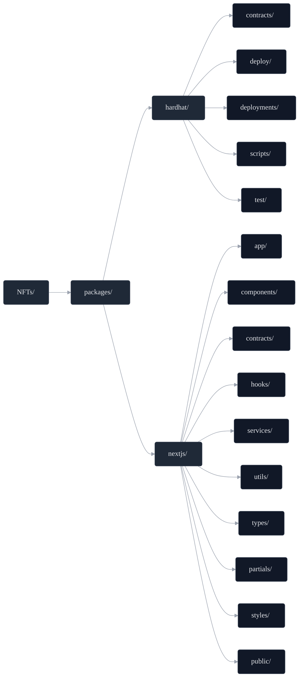
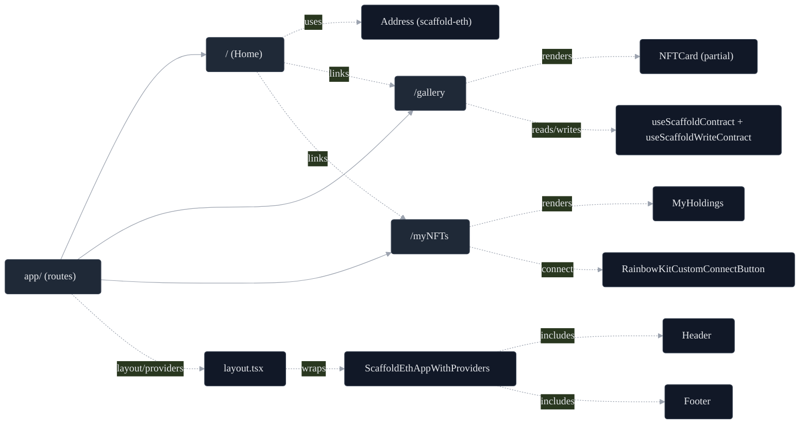
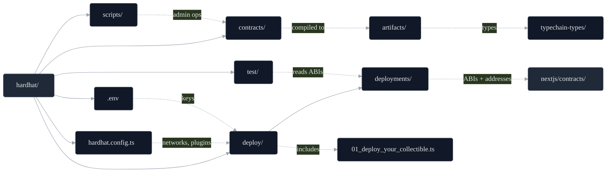

<h1 align="center">Kitten NFT Gallery</h1>
<p align="center">
  <a href="https://nfts-sepia.vercel.app/"></a>
  <a href="https://github.com/ChainsQueenEth/web3dashboard/actions/workflows/ci.yml"></a>
  =20.18.3" />
  
</p>


<h2 align="center">Contents</h2>
<p align="center">
  <a href="#features-at-a-glance">Features at a Glance</a><br/>
  <a href="#ui-showcase">UI Showcase</a><br/>
  <a href="#nft-collection-preview">NFT Collection Preview</a><br/>
  <a href="#tech-stack">Tech Stack</a><br/>
  <a href="#monorepo-structure">Monorepo Structure</a><br/>
  <a href="#ui-routes-nextjs">UI Routes (Next.js)</a><br/>
  <a href="#hardhat-flow">Hardhat Flow</a><br/>
  <a href="#api-route-handlers">API (Route Handlers)</a><br/>
  <a href="#quick-start">Quick Start</a><br/>
  <a href="#environment-variables">Environment Variables</a><br/>
  <a href="#common-commands">Common Commands</a><br/>
  <a href="#contract-overview">Contracts</a><br/>
  <a href="#deployment-notes">Deploy</a><br/>
  <a href="#ipfs-publishing">IPFS</a><br/>
  <a href="#troubleshooting">Troubleshooting</a><br/>
  <a href="#contributing">Contributing</a><br/>
  <a href="#license">License</a>
</p>


<h2 align="center">Features at a Glance</h2>

> Modern, full‑stack ERC‑721 NFT dApp powered by Hardhat (contracts) and Next.js (UI).

<table align="center" width="100%">
  <tr>
    <td width="50%" valign="top">
      <b>✅ Local chain</b><br/>
      Hardhat dev node for rapid iteration<br/>
      <code>yarn chain</code>
    </td>
    <td width="50%" valign="top">
      <b>🚀 Deployment</b><br/>
      One‑command deploys via hardhat-deploy<br/>
      <code>yarn deploy</code>
    </td>
  </tr>
  <tr>
    <td width="50%" valign="top">
      <b>🧾 Verification</b><br/>
      Etherscan contract verification<br/>
      <code>yarn verify</code>
    </td>
    <td width="50%" valign="top">
      <b>🌐 IPFS export</b><br/>
      Static export + publish with bgipfs<br/>
      <code>yarn ipfs</code>
    </td>
  </tr>
</table>


 <h2 align="center">UI Showcase</h2>
<p align="center" style="margin: 28px 0 36px;">
  <span style="display:inline-block; width:49%; text-align:center; vertical-align:top;">
    
    <br />
    <sub>Welcome screen with wallet connect, featured kittens, and quick links to Gallery and My NFTs.</sub>
  </span>
</p>


<p align="center" style="margin: 28px 0 36px;">
  <span style="display:inline-block; width:49%; text-align:center; vertical-align:top;">
    
    <br />
    <sub>Gallery page with all kittens displayed in a grid layout.</sub>
  </span>
</p>


<p align="center" style="margin: 28px 0 36px;">
  <span style="display:inline-block; width:49%; text-align:center; vertical-align:top;">
    
    <br />
    <sub>My NFTs page with a list of all kittens owned by the user.</sub>
  </span>
</p>


<h2 align="center">NFT Collection Preview</h2>
<p align="center" style="max-width: 720px; margin: 0 auto;">
  
  <br />
  <sub>Animated preview of the kitten collection.</sub>
</p>


<h2 align="center">Tech Stack</h2>

| Category  | Tools | Purpose |
|---|---|---|
| Contracts | Solidity, Hardhat, OpenZeppelin (ERC721) | Smart contracts and standards |
| Frontend | Next.js 15, React 19, Tailwind, DaisyUI | UI, styling, components |
| Web3 | wagmi, viem, RainbowKit | Wallet connect and contract calls |
| Language | TypeScript | Types and DX |
| Quality | ESLint, Prettier | Linting and formatting |
| Deploy | hardhat-deploy, Vercel (optional) | Contract + app deployment |
| IPFS | bgipfs | Static export + upload |
| API (UI) | Next.js Route Handlers (`app/api/*`) | Server-side endpoints |

> Architecture: Hardhat compiles/deploys ERC‑721 contracts and writes ABIs/addresses to the repo; the Next.js app (wagmi/viem) consumes them. IPFS is used both for NFT metadata and optional static site publishing.

<h2 align="center">Monorepo Structure</h2>



_Monorepo folders and key subdirectories._

<h2 align="center">UI Routes (Next.js)</h2>



_Client routes and key components/providers._

<h2 align="center">API (Route Handlers)</h2>

| Route | Method | Body | Description |
|---|---|---|---|
| `/api/ipfs/add` | POST | JSON (metadata object) | Adds JSON to IPFS via bgipfs utils |
| `/api/ipfs/get-metadata` | POST | `{ ipfsHash: string }` | Fetches NFT metadata by IPFS hash |

<h2 align="center">Hardhat Flow</h2>



_End‑to‑end Hardhat compile → deploy → consume._

<h2 align="center">Quick Start</h2>

1) Requirements
   - Node >= 20.18.3
   - Yarn 3.x (see `"packageManager": "yarn@3.2.3"`)

2) Install

```bash
yarn install
```

3) Configure envs

- Hardhat: copy `packages/hardhat/.env.example` → `packages/hardhat/.env`
  - Set: `ALCHEMY_API_KEY`, `ETHERSCAN_V2_API_KEY`
  - Deployer key: `yarn account:generate` or `yarn account:import`
- Next.js: copy `packages/nextjs/.env.example` → `packages/nextjs/.env`
  - Fill any required `NEXT_PUBLIC_*` vars

  
<h2 align="center">Environment Variables</h2>

| App | File | Variable | Purpose |
|---|---|---|---|
| Hardhat | `packages/hardhat/.env` | `ALCHEMY_API_KEY` | RPC provider for deployments/tests |
| Hardhat | `packages/hardhat/.env` | `ETHERSCAN_V2_API_KEY` | Contract verification |
| Hardhat | `packages/hardhat/.env` | `DEPLOYER_PRIVATE_KEY` | Deployer account (keep secret) |
| Next.js | `packages/nextjs/.env` | `NEXT_PUBLIC_*` | Public UI config (chain id, RPC, flags) |

> Security: Never commit `.env` files or private keys. Use a separate deployer account with minimal funds for testnets.

4) Run locally

```bash
# Terminal 1
yarn chain

# Terminal 2
yarn compile && yarn deploy

# Terminal 3
yarn start
# Open http://localhost:3000
```

<h2 align="center">Common Commands</h2>
<details>
<summary><b>Show commands</b></summary>

- __Contracts__
  - `yarn compile` – Compile contracts
  - `yarn test` – Run tests on Hardhat network
  - `yarn deploy` – Deploy using `hardhat-deploy` (uses deployer key)
  - `yarn verify` – Verify on Etherscan (set `ETHERSCAN_V2_API_KEY`)
  - `yarn hardhat:flatten` – Flatten contracts
  - Accounts utils:
    - `yarn account` – List account(s)
    - `yarn account:generate` – Generate deployer
    - `yarn account:import` – Import private key
    - `yarn account:reveal-pk` – Reveal stored PK

- __Frontend__
  - `yarn start` – Next.js dev
  - `yarn next:build` / `yarn next:serve` – Build/serve
  - `yarn ipfs` – Static export + upload to IPFS via bgipfs

- __Quality__
  - `yarn lint` – Lint (frontend + contracts)
  - `yarn format` – Prettier format

</details>

<h2 align="center">Contract Overview</h2>

[YourCollectible.sol](packages/hardhat/contracts/YourCollectible.sol) (ERC721, Enumerable, URI Storage, Ownable):
- `mintItem(address to, string uri)` – Mints a token with a full tokenURI.
- `mintBatch(address to, string[] uris)` – Batch mint multiple URIs.
- Emits `Minted(tokenId, to, uri)`.
- Token IDs auto-increment via `tokenIdCounter`.

You can host your metadata JSON (e.g., in `metadata/`) and images (e.g., `img/`) on IPFS and use their IPFS URIs when minting.

<h2 align="center">Deployment Notes</h2>

- Networks and RPC keys are configured in [packages/hardhat/hardhat.config.ts](packages/hardhat/hardhat.config.ts) and [.env](packages/hardhat/.env).
- Deployed addresses and ABIs are stored in `packages/hardhat/deployments/` for consumption by the frontend.
- For Etherscan verification: ensure contracts are flattened/configured or use `yarn verify` with correct constructor args.

<h2 align="center">IPFS Publishing</h2>

- `yarn ipfs` will:
  - Build the Next.js app (static export)
  - Upload to IPFS via `bgipfs`, then print the resulting CID and gateway URL

<h2 align="center">Troubleshooting</h2>
<details>
<summary><b>Show troubleshooting</b></summary>

- Ensure Node and Yarn versions match repo engines.
- If contracts/types are stale: `yarn hardhat:clean && yarn compile`.
- If wallet connection fails in UI, check the configured chain and RPC in Next.js [.env](packages/nextjs/.env).

</details>

<h2 align="center">Contributing</h2>

See [CONTRIBUTING.md](CONTRIBUTING.md).

## License

This project is licensed under the terms of the [LICENCE](LICENCE).