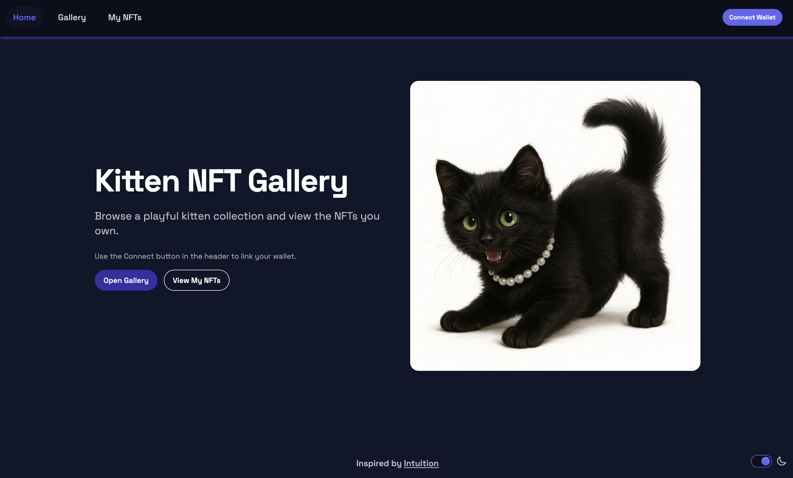
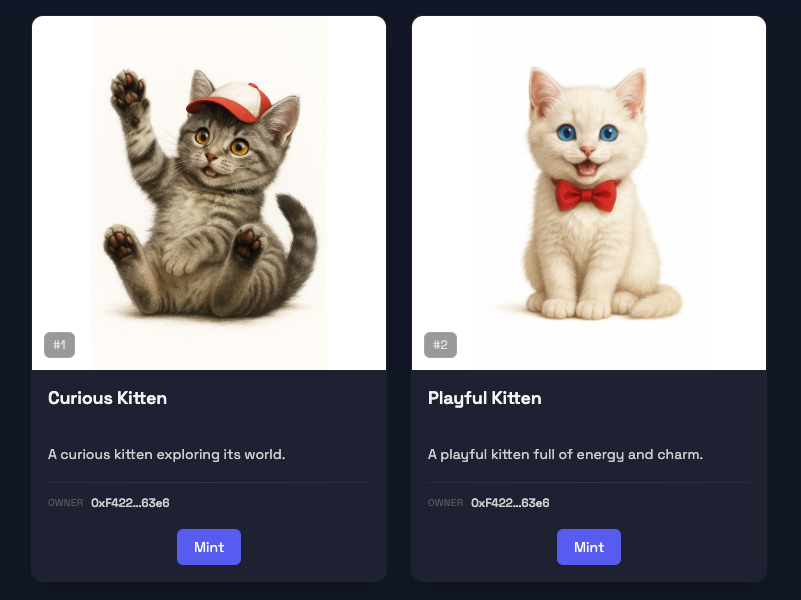
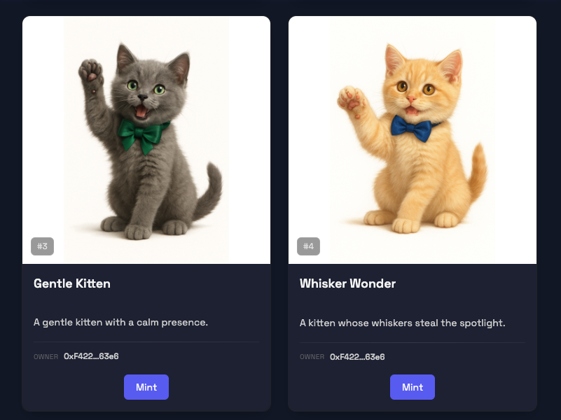
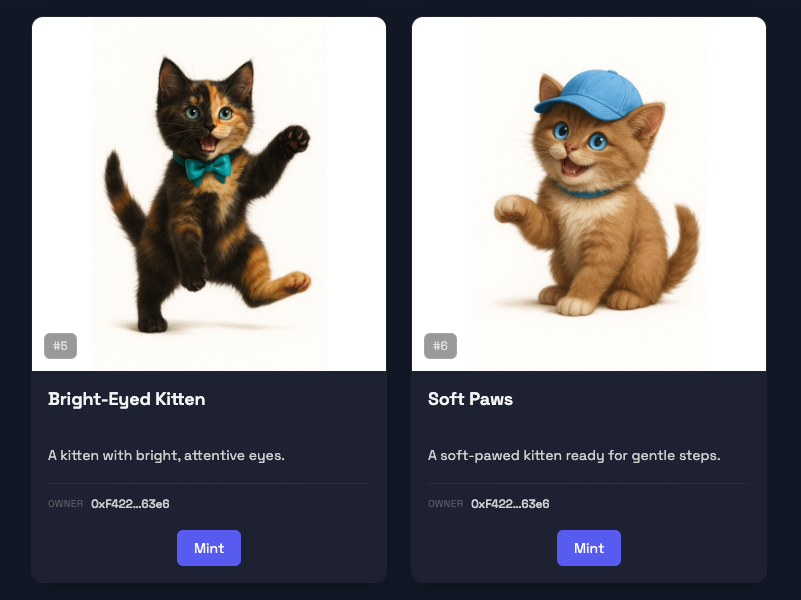
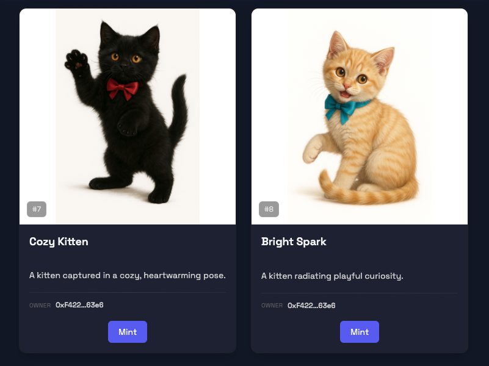
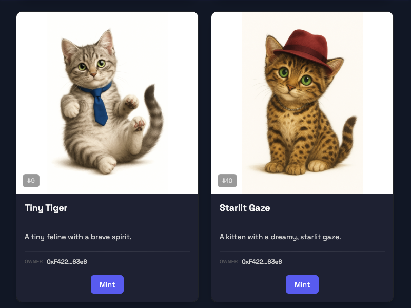
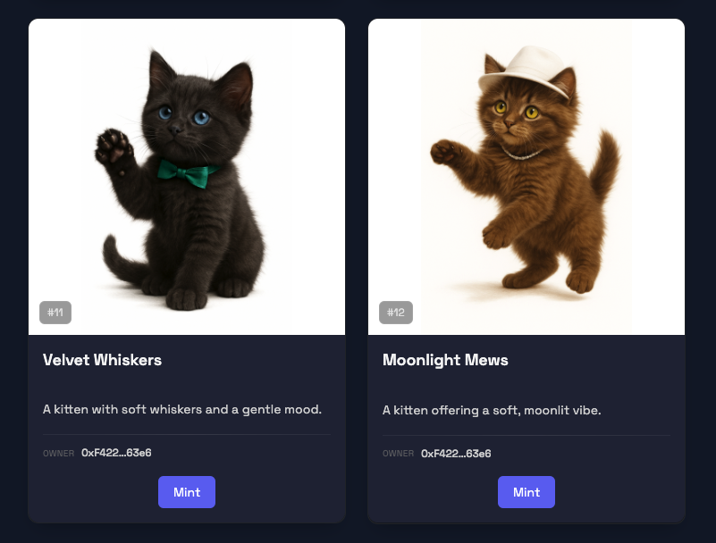
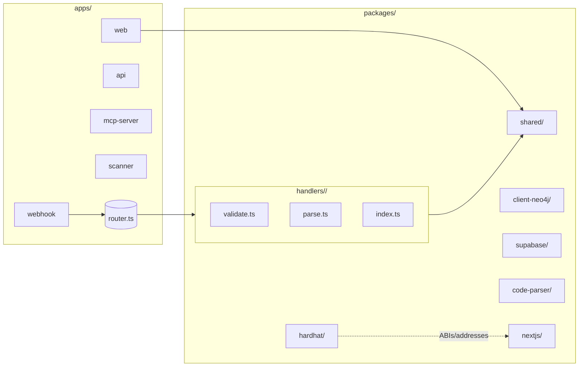

# YourCollectible NFT dApp

A full-stack ERC-721 NFT project built with Hardhat (contracts) and Next.js (dApp UI). Includes local chain, deployment, verification, and optional static export to IPFS.

## Live App

<h3>Home & Gallery</h3>

  
    
     
    Home page
  
  
    
     
    Gallery page
  

### Sample NFTs

  
    
     
    Kitten 1
  
  
    
     
    Kitten 2
  
  
    
     
    Kitten 3
  

  
    
     
    Kitten 4
  
  
    
     
    Kitten 5
  
  
    
     
    Kitten 6
  

## Tech Stack

| Category   | Tools |
|------------|-------|
| Contracts  | Solidity, Hardhat, hardhat-deploy, OpenZeppelin (ERC721, Enumerable, URI Storage) |
| Frontend   | Next.js 15, React 19, Tailwind CSS 4, DaisyUI |
| Web3       | wagmi, viem, RainbowKit |
| State/Data | Zustand, TanStack Query |
| Utilities  | TypeScript, ESLint, Prettier, bgipfs (IPFS), Vercel (optional) |

## Monorepo Structure

Legend:
- __apps/__ orchestrates entrypoints (no provider logic). `apps/webhook` dispatches to `packages/handlers/{provider}/router.ts`.
- __packages/handlers/{provider}/__ contains provider-specific logic (`validate.ts`, `parse.ts`, `index.ts`).
- __packages/shared/__ holds shared types and normalized events.
- __packages/hardhat/__ contracts, deployments, ABIs. Exposes ABIs/addresses consumed by `packages/nextjs/`.
- __packages/nextjs/__ Next.js dApp UI using ABIs from `hardhat`.

## Prerequisites

- Node >= 20.18.3
- Yarn 3.x (repo uses Yarn; see `"packageManager": "yarn@3.2.3"`)

## Setup

1. Install dependencies:
   - `yarn install`

2. Configure envs:
   - Copy [packages/hardhat/.env.example](packages/hardhat/.env.example) to [packages/hardhat/.env](packages/hardhat/.env)
     - Set: `ALCHEMY_API_KEY`, `ETHERSCAN_V2_API_KEY`
     - Generate or import deployer key:
       - `yarn account:generate` or `yarn account:import`
   - Copy [packages/nextjs/.env.example](packages/nextjs/.env.example) to `packages/nextjs/.env`
     - Fill any required NEXT_PUBLIC_* values per your setup

## Local Development

- Start local Hardhat chain:
  - `yarn chain`
- In another terminal, compile and deploy:
  - `yarn compile`
  - `yarn deploy`
- Start the Next.js app:
  - `yarn start`
- Open: http://localhost:3000

## Common Commands

- Contracts
  - `yarn compile` – Compile contracts
  - `yarn test` – Run tests on Hardhat network
  - `yarn deploy` – Deploy using `hardhat-deploy` (uses deployer key)
  - `yarn verify` – Verify on Etherscan (set `ETHERSCAN_V2_API_KEY`)
  - `yarn hardhat:flatten` – Flatten contracts
  - Accounts utils:
    - `yarn account` – List account(s)
    - `yarn account:generate` – Generate deployer
    - `yarn account:import` – Import private key
    - `yarn account:reveal-pk` – Reveal stored PK

- Frontend
  - `yarn start` – Next.js dev
  - `yarn next:build` / `yarn next:serve` – Build/serve
  - `yarn ipfs` – Static export + upload to IPFS via bgipfs

- Quality
  - `yarn lint` – Lint (frontend + contracts)
  - `yarn format` – Prettier format

## Contract Overview

[YourCollectible.sol](packages/hardhat/contracts/YourCollectible.sol) (ERC721, Enumerable, URI Storage, Ownable):
- `mintItem(address to, string uri)` – Mints a token with a full tokenURI.
- `mintBatch(address to, string[] uris)` – Batch mint multiple URIs.
- Emits `Minted(tokenId, to, uri)`.
- Token IDs auto-increment via `tokenIdCounter`.

You can host your metadata JSON (e.g., in `metadata/`) and images (e.g., `img/`) on IPFS and use their IPFS URIs when minting.

## Deployment Notes

- Networks and RPC keys are configured in [packages/hardhat/hardhat.config.ts](packages/hardhat/hardhat.config.ts) and [.env](packages/hardhat/.env).
- Deployed addresses and ABIs are stored in `packages/hardhat/deployments/` for consumption by the frontend.
- For Etherscan verification: ensure contracts are flattened/configured or use `yarn verify` with correct constructor args.

## IPFS Publishing

- `yarn ipfs` will:
  - Build the Next.js app (static export)
  - Upload to IPFS via `bgipfs`, then print the resulting CID and gateway URL

## Troubleshooting

- Ensure Node and Yarn versions match repo engines.
- If contracts/types are stale: `yarn hardhat:clean && yarn compile`.
- If wallet connection fails in UI, check the configured chain and RPC in Next.js [.env](packages/nextjs/.env).