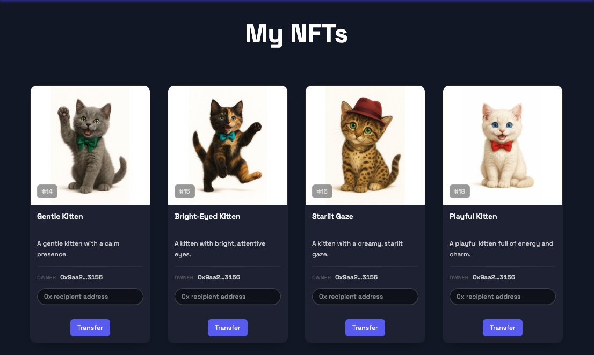
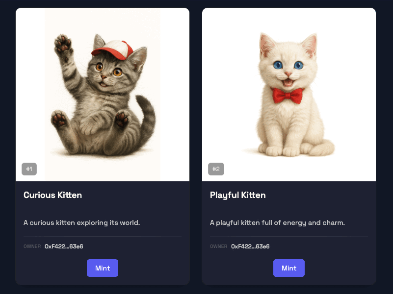
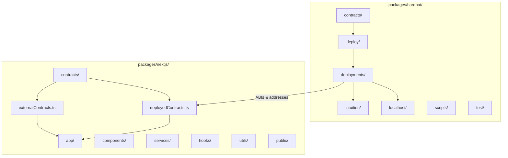

<h1 align="center">Kitten NFT Gallery</h1>
<p align="center">
  <a href="https://nfts-sepia.vercel.app/"></a>
  =20.18.3" />
  <a href="https://github.com/ChainsQueenEth/web3dashboard/actions/workflows/ci.yml"></a>
</p>

Modern, full‑stack ERC‑721 NFT dApp powered by Hardhat (contracts) and Next.js (UI).

What you get out of the box:
- __Local chain__: Hardhat dev node for rapid iteration (`yarn chain`).
- __Deployment__: One‑command deploys via `hardhat-deploy` (`yarn deploy`).
- __Verification__: Etherscan verification (`yarn verify`).
- __IPFS export__: Static export + publish with `bgipfs` (`yarn ipfs`).

<h2 align="center">Contents</h2>

<p align="center">
  <a href="#tech-stack">Tech Stack</a> ·
  <a href="#monorepo-structure">Structure</a> ·
  <a href="#quick-start">Quick Start</a> ·
  <a href="#common-commands">Commands</a> ·
  <a href="#contract-overview">Contracts</a> ·
  <a href="#deployment-notes">Deploy</a> ·
  <a href="#ipfs-publishing">IPFS</a> ·
  <a href="#troubleshooting">Troubleshooting</a>
</p>
 
<p align="center" style="margin: 28px 0 36px;">
  <span style="display:inline-block; width:49%; text-align:center; vertical-align:top;">
    
    <br />
    <sub>Welcome screen with wallet connect, featured kittens, and quick links to Gallery and My NFTs.</sub>
  </span>
</p>


<p align="center" style="margin: 28px 0 36px;">
  <span style="display:inline-block; width:49%; text-align:center; vertical-align:top;">
    
    <br />
    <sub>Gallery page with all kittens displayed in a grid layout.</sub>
  </span>
</p>


<p align="center" style="margin: 28px 0 36px;">
  <span style="display:inline-block; width:49%; text-align:center; vertical-align:top;">
    
    <br />
    <sub>My NFTs page with a list of all kittens owned by the user.</sub>
  </span>
</p>


<h2 align="center">Kitten NFTs</h2>
<p align="center" style="max-width: 720px; margin: 0 auto;">
  
  <br />
  <sub>Animated preview of the kitten collection.</sub>
  
</p>


## Tech Stack

| Category   | Tools |
|------------|-------|
| Contracts  | Solidity, Hardhat, hardhat-deploy, OpenZeppelin (ERC721, Enumerable, URI Storage) |
| Frontend   | Next.js 15, React 19, Tailwind CSS 4, DaisyUI |
| Web3       | wagmi, viem, RainbowKit |
| State/Data | Zustand, TanStack Query |
| Utilities  | TypeScript, ESLint, Prettier, bgipfs (IPFS), Vercel (optional) |

## Monorepo Structure



Legend:
- __packages/hardhat/__ contracts, deployments, ABIs (`deployments/`).
- __packages/nextjs/__ Next.js dApp UI consuming ABIs/addresses from `packages/nextjs/contracts/`.

## Quick Start

1) Requirements
   - Node >= 20.18.3
   - Yarn 3.x (see `"packageManager": "yarn@3.2.3"`)

2) Install

```bash
yarn install
```

3) Configure envs

- Hardhat: copy `packages/hardhat/.env.example` → `packages/hardhat/.env`
  - Set: `ALCHEMY_API_KEY`, `ETHERSCAN_V2_API_KEY`
  - Deployer key: `yarn account:generate` or `yarn account:import`
- Next.js: copy `packages/nextjs/.env.example` → `packages/nextjs/.env`
  - Fill any required `NEXT_PUBLIC_*` vars

4) Run locally

```bash
# Terminal 1
yarn chain

# Terminal 2
yarn compile && yarn deploy

# Terminal 3
yarn start
# Open http://localhost:3000
```

## Common Commands

- __Contracts__
  - `yarn compile` – Compile contracts
  - `yarn test` – Run tests on Hardhat network
  - `yarn deploy` – Deploy using `hardhat-deploy` (uses deployer key)
  - `yarn verify` – Verify on Etherscan (set `ETHERSCAN_V2_API_KEY`)
  - `yarn hardhat:flatten` – Flatten contracts
  - Accounts utils:
    - `yarn account` – List account(s)
    - `yarn account:generate` – Generate deployer
    - `yarn account:import` – Import private key
    - `yarn account:reveal-pk` – Reveal stored PK

- __Frontend__
  - `yarn start` – Next.js dev
  - `yarn next:build` / `yarn next:serve` – Build/serve
  - `yarn ipfs` – Static export + upload to IPFS via bgipfs

- __Quality__
  - `yarn lint` – Lint (frontend + contracts)
  - `yarn format` – Prettier format

## Contract Overview

[YourCollectible.sol](packages/hardhat/contracts/YourCollectible.sol) (ERC721, Enumerable, URI Storage, Ownable):
- `mintItem(address to, string uri)` – Mints a token with a full tokenURI.
- `mintBatch(address to, string[] uris)` – Batch mint multiple URIs.
- Emits `Minted(tokenId, to, uri)`.
- Token IDs auto-increment via `tokenIdCounter`.

You can host your metadata JSON (e.g., in `metadata/`) and images (e.g., `img/`) on IPFS and use their IPFS URIs when minting.

## Deployment Notes

- Networks and RPC keys are configured in [packages/hardhat/hardhat.config.ts](packages/hardhat/hardhat.config.ts) and [.env](packages/hardhat/.env).
- Deployed addresses and ABIs are stored in `packages/hardhat/deployments/` for consumption by the frontend.
- For Etherscan verification: ensure contracts are flattened/configured or use `yarn verify` with correct constructor args.

## IPFS Publishing

- `yarn ipfs` will:
  - Build the Next.js app (static export)
  - Upload to IPFS via `bgipfs`, then print the resulting CID and gateway URL

## Troubleshooting

- Ensure Node and Yarn versions match repo engines.
- If contracts/types are stale: `yarn hardhat:clean && yarn compile`.
- If wallet connection fails in UI, check the configured chain and RPC in Next.js [.env](packages/nextjs/.env).